# Context Diagram (Level 0) - SoleMate System

## Description

The Context Diagram provides the highest-level view of the SoleMate system, showing the system boundary and all external entities that interact with it. This diagram establishes the scope of the system and identifies all external interfaces.

### External Entities

1. **USER**: The end user who interacts with the SoleMate mobile application to try on shoes, browse catalog, match outfits, and manage their try-on history.

2. **FIREBASE_AUTH**: Google Firebase Authentication service that handles user authentication, token generation, and user verification.

3. **MONGODB**: MongoDB Atlas database that stores structured data including product catalogs, user profiles, try-on history, outfit matches, and custom shoe skins.

4. **CLOUD_STORAGE**: Cloud storage service (Firebase Storage/AWS S3) that stores large binary assets including 3D shoe models (GLB/GLTF files), textures, and images.

5. **AR_CORE**: Google ARCore SDK service (optional) that provides AR tracking capabilities on supported Android devices. On non-ARCore devices, the system uses a VIO (Visual-Inertial Odometry) fallback.

### Data Flows

**From USER to SOLEMATE SYSTEM:**
- Login credentials (email, password)
- AR session requests (start/stop AR)
- Shoe selections (product IDs)
- Outfit images (for matching)
- User preferences (shoe size, calibration data)
- Custom skin designs
- Try-on save requests

**From SOLEMATE SYSTEM to USER:**
- AR overlay (real-time shoe visualization)
- Product recommendations
- Try-on history
- Catalog data (shoe listings)
- Authentication status
- Outfit match results

**Between SOLEMATE SYSTEM and FIREBASE_AUTH:**
- Authentication tokens (ID tokens)
- User verification requests
- Token validation
- User session data

**Between SOLEMATE SYSTEM and MONGODB:**
- Product data queries
- Try-on history records
- User profile data
- Outfit match results
- Custom skin metadata

**Between SOLEMATE SYSTEM and CLOUD_STORAGE:**
- 3D model file requests (GLB/GLTF)
- Texture file requests
- Image uploads/downloads
- Pre-signed URLs

**Between SOLEMATE SYSTEM and AR_CORE:**
- AR session initialization
- Camera frame data
- Tracking state
- Plane detection results
- Anchor positions

## Mermaid.js Diagram Code

```mermaid
flowchart TB
    %% External Entities (3D boxes in Gane & Sarson)
    USER[USER]
    FIREBASE[FIREBASE_AUTH]
    MONGO[(MONGODB)]
    STORAGE[(CLOUD_STORAGE)]
    ARCORE[AR_CORE]
    
    %% System Boundary
    subgraph SYSTEM[" "]
        SOLEMATE[SOLEMATE SYSTEM]
    end
    
    %% Data Flows from User
    USER -->|Login Credentials| SOLEMATE
    USER -->|AR Session Requests| SOLEMATE
    USER -->|Shoe Selections| SOLEMATE
    USER -->|Outfit Images| SOLEMATE
    USER -->|User Preferences| SOLEMATE
    USER -->|Custom Skin Designs| SOLEMATE
    USER -->|Try-on Save Requests| SOLEMATE
    
    %% Data Flows to User
    SOLEMATE -->|AR Overlay| USER
    SOLEMATE -->|Product Recommendations| USER
    SOLEMATE -->|Try-on History| USER
    SOLEMATE -->|Catalog Data| USER
    SOLEMATE -->|Authentication Status| USER
    SOLEMATE -->|Outfit Match Results| USER
    
    %% Data Flows with Firebase Auth
    SOLEMATE <-->|Authentication Tokens| FIREBASE
    SOLEMATE <-->|User Verification| FIREBASE
    SOLEMATE <-->|Token Validation| FIREBASE
    
    %% Data Flows with MongoDB
    SOLEMATE <-->|Product Data| MONGO
    SOLEMATE <-->|Try-on History| MONGO
    SOLEMATE <-->|User Profiles| MONGO
    SOLEMATE <-->|Outfit Matches| MONGO
    SOLEMATE <-->|Custom Skin Metadata| MONGO
    
    %% Data Flows with Cloud Storage
    SOLEMATE <-->|3D Model Files| STORAGE
    SOLEMATE <-->|Texture Files| STORAGE
    SOLEMATE <-->|Images| STORAGE
    SOLEMATE <-->|Pre-signed URLs| STORAGE
    
    %% Data Flows with ARCore
    SOLEMATE <-->|AR Session Data| ARCORE
    SOLEMATE <-->|Camera Frames| ARCORE
    SOLEMATE <-->|Tracking State| ARCORE
    SOLEMATE <-->|Plane Detection| ARCORE
    
    %% Styling
    classDef externalEntity fill:#e1f5ff,stroke:#01579b,stroke-width:2px
    classDef system fill:#fff3e0,stroke:#e65100,stroke-width:3px
    classDef database fill:#f3e5f5,stroke:#4a148c,stroke-width:2px
    
    class USER,FIREBASE,ARCORE externalEntity
    class SOLEMATE system
    class MONGO,STORAGE database
```

## Notes

- This diagram shows the system as a single black box (process 0) without revealing internal structure
- All data stores are hidden at this level as they are internal to the system
- The diagram establishes the complete scope of external interactions
- AR_CORE is shown as optional since the system has a VIO fallback for non-ARCore devices

