# Diagram 0 DFD - SoleMate Core Functionality

## Description

Diagram 0 expands the Context Diagram to reveal the major internal processes and data stores within the SoleMate system. This diagram shows how the system is decomposed into six main functional areas while maintaining all external entity connections from the context diagram.

### Processes

1. **1.0 AR OVERLAY**: The core AR try-on process that handles foot detection, camera rendering, 3D model placement, and AR session management. This process integrates with ARCore (or VIO fallback) to provide real-time shoe visualization.

2. **2.0 MANAGE CATALOG**: Handles product browsing, searching, and selection. Retrieves product data from the database and provides catalog information to users.

3. **3.0 MATCH OUTFIT**: Analyzes outfit images to extract dominant colors and recommends complementary shoes. Processes outfit images and queries the product catalog for matches.

4. **4.0 MANAGE TRY-ON CLOSET**: Manages the user's try-on history. Saves AR session snapshots, retrieves previous try-ons, and allows users to compare different shoe try-ons.

5. **5.0 MANAGE USER AUTHENTICATION**: Handles user login, logout, registration, and session management. Integrates with Firebase Auth for authentication and manages user profiles.

6. **6.0 CUSTOMIZE SHOE SKINS**: Allows users to create and manage personalized shoe textures. Handles skin creation, editing, and application to shoe models in AR.

### Data Stores

- **D1 PRODUCTS**: Stores shoe catalog data including product IDs, names, descriptions, images, 3D model references, colors, sizes, and pricing information.

- **D2 TRY-ON HISTORY**: Stores saved AR try-on sessions including user ID, shoe ID, snapshot URLs, timestamps, and custom skin information.

- **D3 USER PROFILES**: Stores user account information including user ID, email, preferences, shoe size, calibration data, and profile settings.

- **D4 OUTFIT MATCHES**: Stores outfit analysis results including user ID, outfit image URLs, extracted dominant colors, recommended shoe IDs, and match scores.

- **D5 CUSTOM SKINS**: Stores user-created shoe skin designs including skin ID, user ID, color values, texture types, shine levels, and metadata.

- **D6 CALIBRATION DATA**: Stores user-specific calibration information including shoe size (in cm), phone height (in meters), and calibration timestamps for accurate AR placement.

### Key Data Flows

**AR Overlay (1.0) Flows:**
- Receives shoe selections from User
- Loads shoe models from Cloud Storage (via 3D model references)
- Retrieves calibration data from D6
- Saves try-on sessions to D2
- Sends AR overlay visualization to User
- Receives AR session data from AR_CORE

**Manage Catalog (2.0) Flows:**
- Queries D1 for product data
- Sends catalog data to User
- Receives product search requests from User

**Match Outfit (3.0) Flows:**
- Receives outfit images from User
- Stores analysis results in D4
- Queries D1 for matching products
- Sends recommendations to User

**Manage Try-On Closet (4.0) Flows:**
- Reads/writes D2 for try-on history
- Retrieves product data from D1 (for display)
- Sends try-on history to User

**Manage User Authentication (5.0) Flows:**
- Exchanges authentication data with FIREBASE_AUTH
- Reads/writes D3 for user profiles
- Sends authentication status to User

**Customize Shoe Skins (6.0) Flows:**
- Reads/writes D5 for custom skins
- Sends skin data to AR Overlay (1.0) for preview
- Receives skin designs from User

## Mermaid.js Diagram Code

```mermaid
flowchart TB
    %% External Entities
    USER[USER]
    FIREBASE[FIREBASE_AUTH]
    MONGO[(MONGODB)]
    STORAGE[(CLOUD_STORAGE)]
    ARCORE[AR_CORE]
    
    %% Processes (rounded rectangles)
    AR_OVERLAY["1.0<br/>AR OVERLAY"]
    MANAGE_CATALOG["2.0<br/>MANAGE CATALOG"]
    MATCH_OUTFIT["3.0<br/>MATCH OUTFIT"]
    MANAGE_CLOSET["4.0<br/>MANAGE TRY-ON CLOSET"]
    MANAGE_AUTH["5.0<br/>MANAGE USER AUTHENTICATION"]
    CUSTOMIZE_SKINS["6.0<br/>CUSTOMIZE SHOE SKINS"]
    
    %% Data Stores (open rectangles)
    D1[("D1<br/>PRODUCTS")]
    D2[("D2<br/>TRY-ON HISTORY")]
    D3[("D3<br/>USER PROFILES")]
    D4[("D4<br/>OUTFIT MATCHES")]
    D5[("D5<br/>CUSTOM SKINS")]
    D6[("D6<br/>CALIBRATION DATA")]
    
    %% User to Processes
    USER -->|Shoe Selections| AR_OVERLAY
    USER -->|AR Session Requests| AR_OVERLAY
    USER -->|Product Search| MANAGE_CATALOG
    USER -->|Outfit Images| MATCH_OUTFIT
    USER -->|Try-on History Requests| MANAGE_CLOSET
    USER -->|Login/Logout| MANAGE_AUTH
    USER -->|Skin Designs| CUSTOMIZE_SKINS
    
    %% Processes to User
    AR_OVERLAY -->|AR Overlay| USER
    MANAGE_CATALOG -->|Catalog Data| USER
    MATCH_OUTFIT -->|Recommendations| USER
    MANAGE_CLOSET -->|Try-on History| USER
    MANAGE_AUTH -->|Auth Status| USER
    CUSTOMIZE_SKINS -->|Skin Preview| USER
    
    %% AR Overlay Flows
    AR_OVERLAY <-->|3D Model Files| STORAGE
    AR_OVERLAY <-->|AR Session Data| ARCORE
    AR_OVERLAY -->|Save Try-on| D2
    AR_OVERLAY -->|Load Calibration| D6
    AR_OVERLAY -->|Load Product| D1
    AR_OVERLAY <-->|Skin Data| CUSTOMIZE_SKINS
    
    %% Manage Catalog Flows
    MANAGE_CATALOG <-->|Product Data| D1
    MANAGE_CATALOG <-->|Product Queries| MONGO
    
    %% Match Outfit Flows
    MATCH_OUTFIT -->|Store Results| D4
    MATCH_OUTFIT -->|Query Products| D1
    MATCH_OUTFIT <-->|Outfit Data| MONGO
    
    %% Manage Closet Flows
    MANAGE_CLOSET <-->|Try-on History| D2
    MANAGE_CLOSET -->|Load Products| D1
    MANAGE_CLOSET <-->|History Data| MONGO
    
    %% Manage Auth Flows
    MANAGE_AUTH <-->|Auth Tokens| FIREBASE
    MANAGE_AUTH <-->|User Profiles| D3
    MANAGE_AUTH <-->|User Data| MONGO
    
    %% Customize Skins Flows
    CUSTOMIZE_SKINS <-->|Custom Skins| D5
    CUSTOMIZE_SKINS <-->|Skin Data| MONGO
    
    %% Calibration Data Flows
    MANAGE_AUTH -->|Store Calibration| D6
    AR_OVERLAY -->|Read Calibration| D6
    
    %% Styling
    classDef process fill:#e8f5e9,stroke:#2e7d32,stroke-width:2px
    classDef dataStore fill:#fff3e0,stroke:#e65100,stroke-width:2px
    classDef externalEntity fill:#e1f5ff,stroke:#01579b,stroke-width:2px
    classDef database fill:#f3e5f5,stroke:#4a148c,stroke-width:2px
    
    class AR_OVERLAY,MANAGE_CATALOG,MATCH_OUTFIT,MANAGE_CLOSET,MANAGE_AUTH,CUSTOMIZE_SKINS process
    class D1,D2,D3,D4,D5,D6 dataStore
    class USER,FIREBASE,ARCORE externalEntity
    class MONGO,STORAGE database
```

## Notes

- All external entities from the Context Diagram are preserved in this diagram
- Data stores are now visible as they are internal to the system
- Process 1.0 (AR OVERLAY) will be further decomposed in Level 1 DFD
- The diagram maintains balanced data flows - all inputs/outputs from Context Diagram are accounted for
- Inter-process communication is shown (e.g., AR Overlay ↔ Customize Skins for skin preview)

