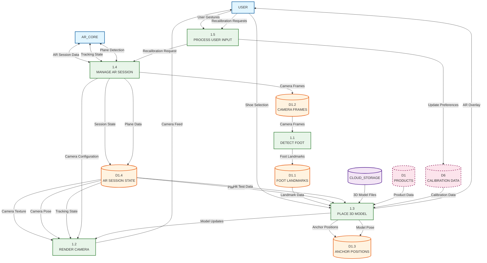

# Level 1 DFD - AR Overlay Process (1.0)

## Description

This Level 1 DFD expands Process 1.0 (AR OVERLAY) from Diagram 0 to show the detailed sub-processes involved in the AR try-on functionality. The AR Overlay process is decomposed into five main sub-processes that work together to provide real-time shoe visualization on the user's feet.

### Sub-Processes

1. **1.1 DETECT FOOT**: Uses MediaPipe Pose Landmarker to detect feet in camera frames. Processes camera frames to extract foot landmarks (ankle, toe, heel positions) with normalized coordinates and visibility scores.

2. **1.2 RENDER CAMERA**: Handles camera feed rendering and display. Manages camera initialization (ARCore or VIO mode), updates camera pose, renders the background camera texture, and handles display rotation changes.

3. **1.3 PLACE 3D MODEL**: Manages 3D shoe model placement and tracking. Converts 2D foot landmarks to 3D world coordinates, performs hit testing to find floor planes, calculates model pose (position, rotation, scale), and renders the shoe model using Filament.

4. **1.4 MANAGE AR SESSION**: Controls AR session lifecycle and tracking state. Initializes ARCore session (or VIO fallback), manages plane detection, handles anchor creation, and maintains tracking state.

5. **1.5 PROCESS USER INPUT**: Handles user interactions and gestures. Processes recalibration requests, handles tap gestures for model placement, manages UI controls, and processes user preferences.

### Data Stores

- **D1.1 FOOT LANDMARKS**: Stores detected foot landmark data including ankle, toe, and heel positions in normalized coordinates (0-1 range), side (left/right), visibility scores, and timestamps.

- **D1.2 CAMERA FRAMES**: Stores raw camera frame data including bitmap images, frame timestamps, and frame metadata for processing by foot detection.

- **D1.3 ANCHOR POSITIONS**: Stores 3D anchor positions and poses including world coordinates, transformation matrices, anchor IDs, and tracking states.

- **D1.4 AR SESSION STATE**: Stores AR session state information including tracking state, detected planes, camera pose, session configuration, and ARCore/VIO mode status.

### External Entities (from parent level)

- **USER**: Provides user input and receives AR overlay visualization
- **AR_CORE**: Provides AR tracking services (optional, fallback to VIO)
- **CLOUD_STORAGE**: Provides 3D shoe model files

### Key Data Flows

**Foot Detection (1.1) Flows:**
- Receives camera frames from D1.2
- Processes frames with MediaPipe
- Stores detected landmarks in D1.1
- Sends landmark data to Place 3D Model (1.3)

**Camera Rendering (1.2) Flows:**
- Receives camera frames from AR Session State (D1.4)
- Renders camera background texture
- Updates display based on rotation
- Provides visual feedback to User

**3D Model Placement (1.3) Flows:**
- Receives foot landmarks from D1.1
- Performs hit testing using AR Session State (D1.4)
- Calculates model pose and stores in D1.3
- Loads 3D models from Cloud Storage
- Renders shoe model to User

**AR Session Management (1.4) Flows:**
- Initializes AR session (ARCore or VIO)
- Detects planes and updates D1.4
- Receives recalibration requests from Process User Input (1.5)
- Provides tracking data to other processes

**User Input Processing (1.5) Flows:**
- Receives user gestures and commands
- Sends recalibration requests to Manage AR Session (1.4)
- Updates user preferences
- Handles UI interactions

## Mermaid.js Diagram Code

## Notes

- This diagram expands Process 1.0 from Diagram 0, maintaining all parent-level data flows
- Processes 1.1, 1.2, and 1.3 will be further decomposed in Level 2 DFDs
- Data stores D1.1 through D1.4 are specific to the AR Overlay process
- Parent-level data stores (D1, D6) are shown with dashed borders to indicate they belong to the parent level
- The diagram shows the real-time processing pipeline: Camera → Foot Detection → 3D Placement → Rendering
- AR Session Management (1.4) coordinates all AR-related operations and provides state to other processes

