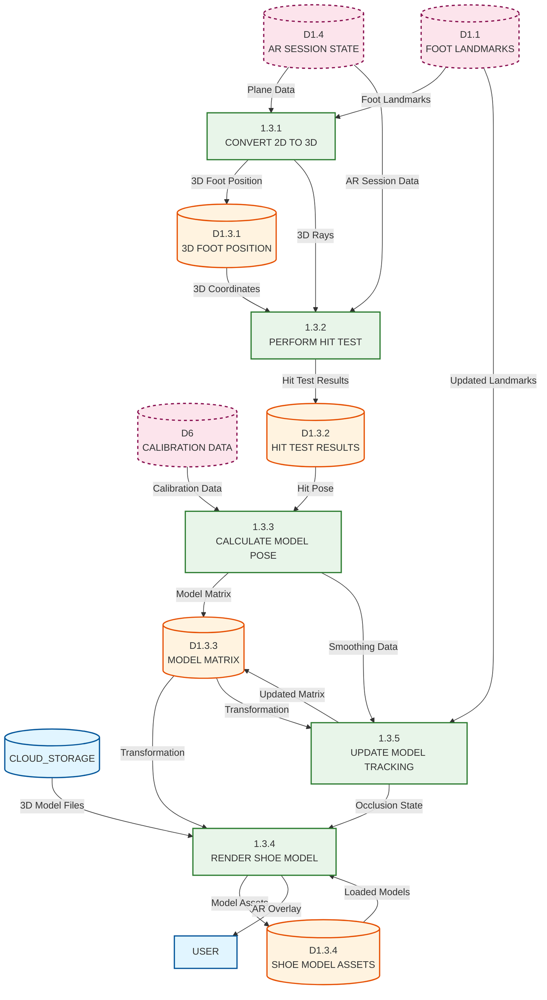

# Level 2 DFD - 3D Shoe Model Placement Process (1.3)

## Description

This Level 2 DFD expands Process 1.3 (PLACE 3D MODEL) from the Level 1 AR Overlay diagram. It details the 3D shoe model placement and tracking pipeline that converts 2D foot landmarks to 3D world coordinates, performs hit testing, calculates model pose, and renders the shoe model using Filament rendering engine.

### Sub-Processes

1. **1.3.1 CONVERT 2D TO 3D**: Converts normalized 2D foot landmarks to 3D world coordinates. Unprojects 2D screen coordinates to 3D rays, calculates intersection with detected planes, determines 3D foot position, and validates coordinate ranges.

2. **1.3.2 PERFORM HIT TEST**: Performs raycast hit testing to find floor plane intersections. Executes hit test from foot landmark position, selects best hit result (Plane > Point > DepthPoint), validates hit distance (0.3m - 3.0m), and extracts hit pose.

3. **1.3.3 CALCULATE MODEL POSE**: Calculates 3D model transformation (position, rotation, scale). Computes model position from hit test result, calculates orientation from ankle-to-toe vector, applies scale calibration (shoe size), applies smoothing filters, and generates transformation matrix.

4. **1.3.4 RENDER SHOE MODEL**: Renders 3D shoe model using Filament engine. Loads GLB/GLTF model from assets, applies transformation matrix, sets up Filament scene, renders model with lighting, and handles model updates.

5. **1.3.5 UPDATE MODEL TRACKING**: Updates and smooths model pose for real-time tracking. Applies temporal smoothing (exponential/Kalman filter), handles occlusion (foot not visible), manages re-anchoring on drift, and updates model position smoothly.

### Data Stores

- **D1.3.1 3D FOOT POSITION**: Stores 3D foot position data including world coordinates (X, Y, Z), foot side (left/right), position confidence, and timestamp.

- **D1.3.2 HIT TEST RESULTS**: Stores hit test output including hit pose (position + orientation), hit type (Plane/Point/DepthPoint), hit distance, plane information, and hit confidence.

- **D1.3.3 MODEL MATRIX**: Stores 3D model transformation matrix including 4x4 transformation matrix, position vector, rotation quaternion, scale factor, and matrix timestamp.

- **D1.3.4 SHOE MODEL ASSETS**: Stores 3D model file references including GLB/GLTF file paths, model metadata, texture references, and asset loading state.

### External Entities (from parent levels)

- **CLOUD_STORAGE**: Provides 3D shoe model files (GLB/GLTF)
- **D1.1 FOOT LANDMARKS**: Parent-level data store for foot landmark data
- **D1.4 AR SESSION STATE**: Parent-level data store for AR session and plane data
- **D6 CALIBRATION DATA**: Parent-level data store for user calibration (shoe size, phone height)

### Key Data Flows

**Convert 2D to 3D (1.3.1) Flows:**
- Receives foot landmarks from parent-level D1.1
- Receives plane data from D1.4
- Unprojects 2D coordinates to 3D rays
- Calculates 3D foot position
- Stores 3D position in D1.3.1
- Sends 3D position to Perform Hit Test (1.3.2)

**Perform Hit Test (1.3.2) Flows:**
- Receives 3D foot position from D1.3.1
- Receives AR session data from D1.4
- Performs raycast hit testing
- Selects best hit result
- Stores hit test results in D1.3.2
- Sends hit pose to Calculate Model Pose (1.3.3)

**Calculate Model Pose (1.3.3) Flows:**
- Receives hit test results from D1.3.2
- Receives calibration data from D6 (shoe size, phone height)
- Calculates model position, rotation, and scale
- Applies smoothing filters
- Stores transformation matrix in D1.3.3
- Sends model matrix to Render Shoe Model (1.3.4) and Update Model Tracking (1.3.5)

**Render Shoe Model (1.3.4) Flows:**
- Receives model matrix from D1.3.3
- Loads 3D model assets from CLOUD_STORAGE (or local assets)
- Applies transformation to model
- Renders model using Filament
- Outputs rendered model to User (via parent level)

**Update Model Tracking (1.3.5) Flows:**
- Receives model matrix from D1.3.3
- Receives updated foot landmarks from D1.1
- Applies temporal smoothing
- Handles occlusion detection
- Updates model matrix in D1.3.3
- Manages re-anchoring when needed

## Mermaid.js Diagram Code

## Notes

- This diagram expands Process 1.3 from Level 1 DFD
- The pipeline follows: Convert → Hit Test → Calculate → Render → Update (loop)
- Multi-sample hit testing improves accuracy (averages multiple hit tests)
- Temporal smoothing reduces jitter in model placement
- Calibration data (shoe size, phone height) ensures accurate scale
- The process handles both initial placement and real-time tracking updates
- Occlusion handling fades out model when foot is not visible
- Filament rendering engine provides high-quality 3D model visualization
- Model assets can be loaded from Cloud Storage or local app assets
- The transformation matrix is continuously updated for smooth tracking

