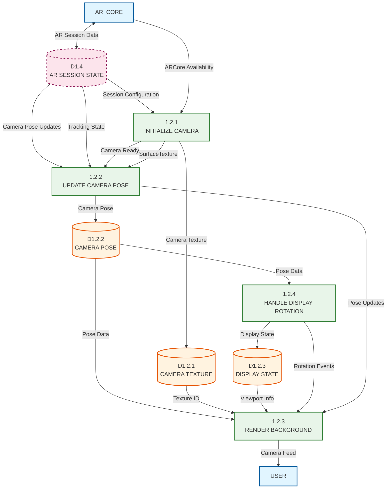

# Level 2 DFD - Camera Rendering Process (1.2)

## Description

This Level 2 DFD expands Process 1.2 (RENDER CAMERA) from the Level 1 AR Overlay diagram. It details the camera feed rendering pipeline that handles camera initialization, pose tracking, background texture rendering, and display rotation management for both ARCore and VIO modes.

### Sub-Processes

1. **1.2.1 INITIALIZE CAMERA**: Sets up camera system for AR rendering. Detects ARCore availability, initializes ARCore session (or VIO fallback), configures camera texture (external OES), creates SurfaceTexture for camera feed, and sets up camera permissions.

2. **1.2.2 UPDATE CAMERA POSE**: Tracks and updates camera position and orientation. Receives camera pose from AR session, updates camera transformation matrix, handles pose smoothing, and manages camera tracking state.

3. **1.2.3 RENDER BACKGROUND**: Renders camera feed as background texture. Binds camera texture to OpenGL, draws camera frame to screen, handles texture updates, and manages rendering pipeline.

4. **1.2.4 HANDLE DISPLAY ROTATION**: Manages device orientation changes. Detects display rotation events, updates viewport dimensions, adjusts camera projection matrix, and handles orientation transitions.

### Data Stores

- **D1.2.1 CAMERA TEXTURE**: Stores camera texture information including OpenGL texture ID, texture dimensions, texture format (external OES), and texture binding state.

- **D1.2.2 CAMERA POSE**: Stores camera pose data including camera position (X, Y, Z), camera orientation (quaternion/matrix), pose timestamp, and tracking confidence.

- **D1.2.3 DISPLAY STATE**: Stores display configuration including viewport width/height, display rotation angle, screen orientation, and projection matrix parameters.

### External Entities (from parent levels)

- **AR_CORE**: Provides AR session data and camera tracking
- **D1.4 AR SESSION STATE**: Parent-level data store for AR session information

### Key Data Flows

**Initialize Camera (1.2.1) Flows:**
- Receives AR session configuration from parent-level D1.4
- Detects ARCore availability from AR_CORE
- Initializes camera system (ARCore or VIO)
- Creates camera texture and stores in D1.2.1
- Sets up SurfaceTexture for camera feed
- Sends camera ready status to Update Camera Pose (1.2.2)

**Update Camera Pose (1.2.2) Flows:**
- Receives camera pose updates from AR_CORE (via D1.4)
- Updates camera transformation matrix
- Stores camera pose in D1.2.2
- Sends pose data to Render Background (1.2.3)
- Provides pose to Handle Display Rotation (1.2.4)

**Render Background (1.2.3) Flows:**
- Receives camera texture from D1.2.1
- Receives camera pose from D1.2.2
- Receives display state from D1.2.3
- Binds texture and renders camera frame
- Outputs rendered frame to User (via parent level)

**Handle Display Rotation (1.2.4) Flows:**
- Detects rotation events from system
- Updates display state in D1.2.3
- Adjusts viewport and projection matrix
- Notifies Render Background (1.2.3) of changes
- Receives camera pose from D1.2.2 for coordinate adjustment

## Mermaid.js Diagram Code

## Notes

- This diagram expands Process 1.2 from Level 1 DFD
- The process supports both ARCore and VIO (fallback) camera modes
- Camera initialization happens once at session start
- Camera pose updates occur every frame for real-time tracking
- Display rotation handling ensures correct rendering regardless of device orientation
- The camera texture uses OpenGL external OES format for direct camera feed rendering
- All processes work together to provide smooth, real-time camera background rendering
- The rendered camera feed serves as the background for AR overlay visualization

