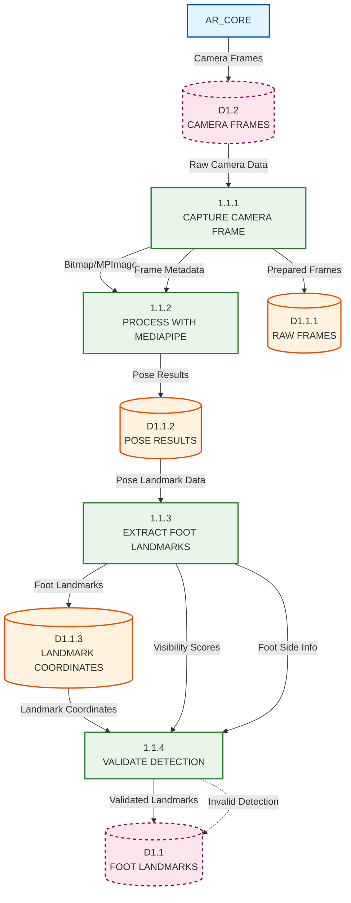

# Level 2 DFD - Foot Detection Process (1.1)

## Description

This Level 2 DFD expands Process 1.1 (DETECT FOOT) from the Level 1 AR Overlay diagram. It details the MediaPipe-based foot detection pipeline that processes camera frames to extract foot landmarks (ankle, toe, heel positions) with normalized coordinates and visibility scores.

### Sub-Processes

1. **1.1.1 CAPTURE CAMERA FRAME**: Retrieves raw camera frames from the camera feed. Converts camera frames to processable format (Bitmap/MPImage), extracts frame metadata (width, height, timestamp), and prepares frames for MediaPipe processing.

2. **1.1.2 PROCESS WITH MEDIAPIPE**: Executes MediaPipe Pose Landmarker on camera frames. Initializes MediaPipe in LIVE_STREAM mode for real-time processing, runs pose detection on each frame, and handles MediaPipe result callbacks asynchronously.

3. **1.1.3 EXTRACT FOOT LANDMARKS**: Extracts foot-specific landmarks from MediaPipe pose results. Identifies ankle landmarks (left/right), toe landmarks (foot index), heel landmarks, calculates normalized coordinates (0-1 range), determines foot side (left/right), and extracts visibility scores.

4. **1.1.4 VALIDATE DETECTION**: Validates detected foot landmarks for quality and reliability. Checks visibility thresholds (minimum 0.15), validates coordinate ranges, filters low-confidence detections, and determines if detection is valid for use.

### Data Stores

- **D1.1.1 RAW FRAMES**: Stores unprocessed camera frame data including raw bitmap images, frame dimensions (width, height), frame timestamps, and frame metadata.

- **D1.1.2 POSE RESULTS**: Stores MediaPipe Pose Landmarker output including full pose landmark data, pose confidence scores, pose detection timestamps, and MediaPipe result metadata.

- **D1.1.3 LANDMARK COORDINATES**: Stores extracted foot landmark coordinates including ankle X/Y (normalized), toe X/Y (normalized), heel X/Y (normalized), foot side (LEFT/RIGHT), visibility scores, and landmark timestamps.

### External Entities (from parent levels)

- **AR_CORE**: Provides camera frame data (via AR Session)
- **D1.2 CAMERA FRAMES**: Parent-level data store for camera frame data

### Key Data Flows

**Capture Camera Frame (1.1.1) Flows:**
- Receives camera frames from parent-level D1.2 (or AR_CORE)
- Converts frames to processable format
- Stores raw frames in D1.1.1
- Sends prepared frames to Process MediaPipe (1.1.2)

**Process with MediaPipe (1.1.2) Flows:**
- Receives prepared frames from Capture Frame (1.1.1)
- Processes frames through MediaPipe Pose Landmarker
- Stores pose results in D1.1.2
- Sends pose data to Extract Landmarks (1.1.3)

**Extract Foot Landmarks (1.1.3) Flows:**
- Receives pose results from D1.1.2
- Extracts foot-specific landmarks (ankle, toe, heel)
- Calculates normalized coordinates
- Stores landmark coordinates in D1.1.3
- Sends landmark data to Validate Detection (1.1.4)

**Validate Detection (1.1.4) Flows:**
- Receives landmark coordinates from D1.1.3
- Validates visibility and coordinate ranges
- Filters invalid detections
- Outputs validated landmarks to parent-level D1.1 (FOOT LANDMARKS)

## Mermaid.js Diagram Code

## Notes

- This diagram expands Process 1.1 from Level 1 DFD
- The pipeline follows a sequential flow: Capture → Process → Extract → Validate
- MediaPipe runs in LIVE_STREAM mode for real-time processing
- Validation ensures only high-quality detections are passed to the parent level
- Invalid detections are filtered out and not stored in D1.1
- The process handles both ARCore and VIO camera modes (frames come from parent-level AR Session)
- Frame metadata (dimensions, timestamps) flows through the pipeline for coordinate normalization

